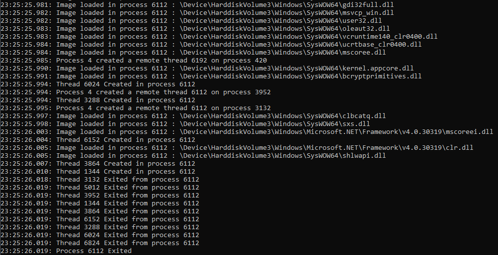

# Process Monitor
This utility allows you to inspect Windows processes and threads life events such as creation and termination. The information is displayed in real time in the console. This is a continuous work in progress with the only goal being to learn windows internals and write better and safer C/C++ code.

# Usage

## Instalation
The driver has to be installed on a machine with test signed enabled. Run the following command from an elevated windows terminal:

    bcdedit -set TESTSIGNING ON
    
Proceed to restart your machine for the effects to take action.

Now we can install our driver service.

    sc create sysmonitor type= kernel binPath= path\to\driver\SysMonitor.sys
    sc start sysmonitor

After installing and starting the sysmonitor service we can now run the usermode application.

# Key features
* Process creation & termination log
* Thread creation & termination log
* Image Load notifications log
* Remote thread creation log

## TODO:
* Process/Image blacklist
* Object creation & termination log
* Registry notifications
